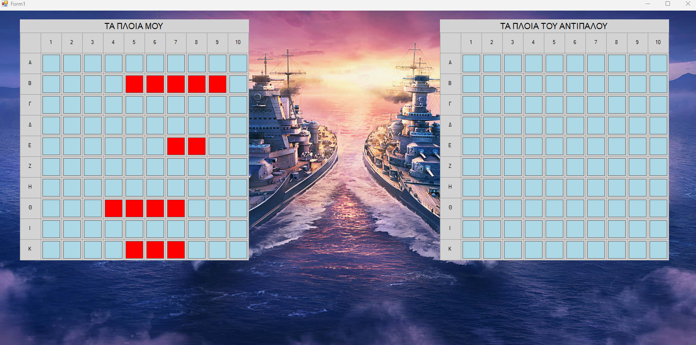

# Battleship Game
 
 A desktop implementation of the classic Battleship game using C#. 
 Features interactive gameplay with a GUI built in Windows Forms and player statistics saved in SQLite.
 Challenge a randomized AI, track your victory stats, and see if you can sink the enemy ships before yours are destroyed!
## About The Project
This project is my take on the classic Battleship game. I created it to practice C# programming, GUI development, and working with databases.  
It demonstrates object-oriented programming and simple AI logic.
## How to Play
1. Enter your name and click "Start".
2. A 10x10 grid will appear for your ships and the enemy's grid.
3. Click on a square in the enemy grid to attack.
4. Hits are marked with a red X, misses with a green dash.
5. The enemy attacks randomly after your turn.
6. Sink all enemy ships to win!
## Features
- GUI built with Windows Forms
- Turn-based gameplay
- Randomized enemy attacks
- Ship placement with collision detection
- Player statistics saved in SQLite database
- Timer for tracking game duration
### Prerequisites
- Any C# IDE that supports WinForms (e.g., Visual Studio, Rider, VS Code with C# extension)  
- .NET runtime installed
 ## Technologies
- C# (.NET)
- Windows Forms
- SQLite
- Visual Studio
## Installation
1. Clone the repository
2. Open the solution in Visual Studio.
3. Build and run the project.
4. Start playing!
